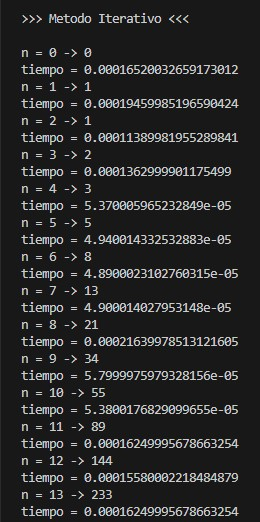
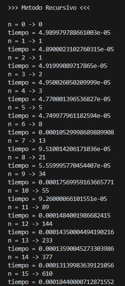
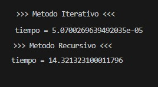

# Fibonacci: Recursive vs Iterative (Python)

## Description

This project compares two different approaches for generating the Fibonacci sequence:

- Iterative implementation
- Recursive implementation

The execution time of each method is measured using Python's `timeit.default_timer()` function, allowing a simple comparison of their computational performance.

---

## Features

- Fibonacci sequence generation
- Iterative algorithm
- Recursive algorithm
- Execution time measurement
- Performance comparison

---

## Technologies

- Python 3
- timeit

---

## Algorithm Comparison

### Iterative

- Uses a loop.
- Linear time complexity **O(n)**.
- Constant memory usage.

### Recursive

- Uses recursive function calls.
- Exponential time complexity **O(2ⁿ)**.
- Higher memory consumption due to recursive calls.

---

## How to Run

```bash
python fibonacci_comparison.py
```

---

## Example Output

```text
##### Numero de Fibonacci #####

>>> Metodo Iterativo <<<

n = 0 -> 0
tiempo = ...

n = 1 -> 1
tiempo = ...

...

>>> Metodo Recursivo <<<

n = 0 -> 0
tiempo = ...

n = 1 -> 1
tiempo = ...
```

---

## Screenshots

### Iterative Execution



---

### Recursive Execution



---

### Time Comparison



---

## Concepts Demonstrated

- Recursion
- Iteration
- Algorithm Analysis
- Time Complexity
- Performance Measurement
- Python Programming

---

## Complexity Analysis

| Algorithm | Time Complexity | Space Complexity |
|------------|----------------|------------------|
| Iterative | O(n) | O(1) |
| Recursive | O(2ⁿ) | O(n) |

---

## Possible Improvements

- Memoization
- Dynamic Programming
- Graphical performance comparison
- User-defined input
- Benchmark using larger values

---

## License

MIT License

---

## Author

Jose Luis Alva Salazar

Computer Systems Engineering

GitHub: Luis Alva
